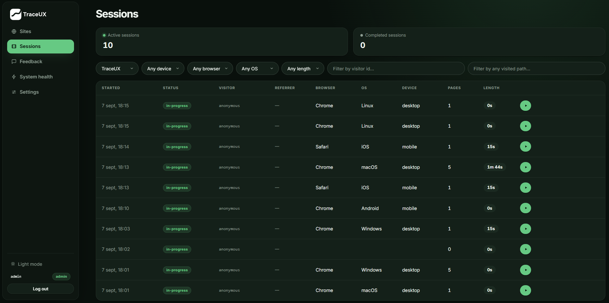
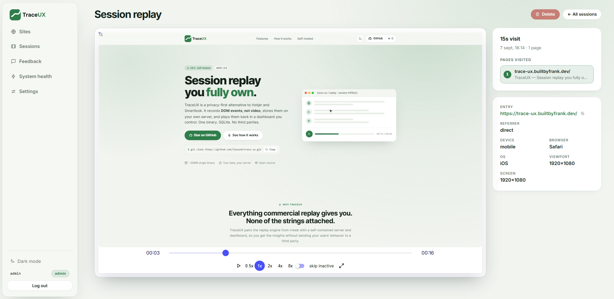

# TraceUX

Self-hosted, open-source session replay for your websites — a lean, privacy-first alternative to Smartlook with an experience you control.

## **Try TraceUX live:** [Open the Live Demo →](https://trace-ux.builtbyfrank.dev/)

With Smartlook shutting down, TraceUX provides a self-hosted path for teams that still need session replay and product feedback without handing their data to another hosted analytics platform. It records how real visitors use your site (DOM event streams, not video), stores them on **your own server**, and plays them back in a clean dashboard. One binary, one SQLite file, one Docker container.

> **Status: v0.2 — session replay core + multi-user access.** Working: multi-page session capture, full replay player, input masking, UTM/referrer attribution, per-site keys, retention, user accounts with admin-managed passwords, 2-hour session cap, filter sessions by any visited path, and recording-linked logs. Roadmap: show logs inside the replay timeline.

**Live landing page:** [trace-ux.builtbyfrank.dev](https://trace-ux.builtbyfrank.dev)

## Why

With Smartlook shutting down, many teams are looking for a replacement that offers a familiar session-replay workflow while keeping data under their control. Existing self-hosted options are often heavy: full analytics suites that need 8 GB+ RAM, multi-service Docker stacks, or paid plugins. TraceUX is built for **a tiny VPS**: a single static binary (~20 MB, ~30 MB RAM) with SQLite and the dashboard embedded. Backups are copying one folder.

## Screenshots

### Sessions dashboard



### Session replay



## Quickstart

**Docker** (recommended):

```bash
mkdir trace-ux && cd trace-ux
docker run -d --name trace-ux -p 127.0.0.1:8080:8080 -v "$PWD/data:/data" \
  -e TRACE_UX_PASSWORD=change-me ghcr.io/fjosue4/trace-ux:latest
```

Or with docker-compose (optional Caddy TLS included):

```bash
cd deploy && TRACE_UX_PASSWORD=change-me docker compose up -d
```

**Single binary** (any Linux/macOS, amd64/arm64):

```bash
TRACE_UX_PASSWORD=change-me TRACE_UX_SECURE_COOKIES=0 ./trace-ux # local HTTP development only
```

Then:

1. Put the dashboard behind HTTPS (the Compose example binds the backend to loopback for this purpose), then open your HTTPS URL and sign in. Leave the username empty (or type `admin`) and use `TRACE_UX_PASSWORD` — that's the bootstrap **admin** account.
2. **Add site** → copy the snippet (the card has a **Manual** and a **Google Tag Manager** tab):

   ```html
   <script async src="https://your-server/t.js" data-site="YOUR_SITE_KEY"></script>
   ```

3. **Manual:** paste it into the `<head>` of every page on your site.
   **Google Tag Manager:** create a *Custom HTML* tag with the snippet from the GTM tab (it sets `data-site` via `setAttribute`, because GTM's script injection drops the attribute), trigger it on *All Pages* and publish.

   Sessions start appearing within seconds.

## Install on a VPS (one script)

On any Linux server with systemd, one line installs everything — the binary ships with the dashboard and tracker embedded, so there is nothing else to set up:

```bash
curl -fsSL https://raw.githubusercontent.com/fjosue4/trace-ux/main/install.sh | sudo bash
```

The script: downloads the prebuilt release for your architecture (checksum-verified), creates a locked-down system user, puts recordings in `/var/lib/trace-ux`, generates an admin password, installs a systemd service (auto-start on boot, auto-restart on crash), and adds a `trace-ux` control command. Re-running it upgrades in place and keeps data and users.

Then manage the server with:

| Command | What it does |
| --- | --- |
| `trace-ux --status` | is it running? |
| `trace-ux --start` / `--stop` / `--restart` | control the service |
| `trace-ux --logs` | last 100 log lines (`journalctl -u trace-ux -f` to follow) |
| `trace-ux --password <new>` | set a new admin password (revokes old admin logins) |
| `trace-ux --update` | upgrade to the latest release |
| `trace-ux --uninstall` | remove it (recordings are kept) |
| `trace-ux --run` | run in the foreground for debugging |

Building from a git clone instead of a release: `bash install.sh --build-from-source` (needs Go ≥ 1.27 and Node ≥ 18). Releases are built automatically by [.github/workflows/release.yml](.github/workflows/release.yml) when a `v*` tag is pushed.

## Minimum requirements

TraceUX is deliberately built for the smallest VPS you can rent:

| Resource | Minimum | Comfortable |
| --- | --- | --- |
| CPU | 1 vCore | 2 vCores |
| RAM | 512 MB (server idles at ~30–50 MB) | 1 GB |
| Disk | 1 GB | 10 GB+ (recordings ≈ 60 KB per typical session; the SQLite file is the whole store) |
| OS | Linux amd64/arm64 with systemd — Debian 11+, Ubuntu 20.04+, Rocky/Alma 9+, Fedora | any of those |
| Network | one open TCP port (8080 by default) | + Caddy/nginx for HTTPS |

No external database, no queue, no other services — SQLite lives in `/var/lib/trace-ux` and backups are copying that folder. Docker is the alternative route (`deploy/docker-compose.yml`) if you prefer containers; the container runs the same binary. In practice: a $4–6/mo VPS handles a handful of sites with thousands of monthly sessions.

## Configuration

| Env var            | Default   | Meaning                                              |
| ------------------ | --------- | ---------------------------------------------------- |
| `TRACE_UX_PASSWORD`      | —         | Required to create the first admin account             |
| `TRACE_UX_RESET_ADMIN`   | —         | `1` = re-point `admin` at `TRACE_UX_PASSWORD` on boot |
| `TRACE_UX_DATA`          | `./data`  | Data dir (SQLite db, users, auth secret)              |
| `TRACE_UX_ADDR`          | `:8080`   | Listen address                                        |
| `TRACE_UX_SECURE_COOKIES`| `1`       | Set `0` only for local HTTP development               |
| `TRACE_UX_TRUSTED_PROXIES`| —        | Comma-separated proxy CIDRs allowed to supply XFF      |
| `TRACE_UX_RETENTION_DAYS`| `90`      | Auto-delete sessions older than this                  |
| `TRACE_UX_DEMO_REPLAY`  | `0`       | Enable short-lived public demo replay links            |
| `TRACE_UX_DEMO_REPLAY_TTL` | `900`  | Demo replay lifetime in seconds (60–3600)             |
| `TRACE_UX_DEV_STATIC`    | —         | Dev only: serve frontend builds from disk             |

## Users & access

The dashboard supports real accounts; the **admin** (the `TRACE_UX_PASSWORD` account) manages them alone, under **Settings → Team** (hidden from viewers):

- **Roles** — `admin` can manage users and sites; `viewer` can browse sites, sessions and replays. Both can change their own password under **Settings**.
- **Creating users** — pick a username and a password (min 8 characters); the user signs in with it directly. No email, no invites.
- **Revocation is immediate** — resetting a password, changing a role, or deleting a user signs that person out everywhere. Changing your own password keeps your current tab signed in.
- **Passwords** are stored as salted PBKDF2-SHA256 hashes (210k iterations); login cookies are random tokens stored only as hashes, so a leaked DB can't be replayed.
- **Locked out?** Restart with `TRACE_UX_RESET_ADMIN=1` to re-point the `admin` account at the current `TRACE_UX_PASSWORD` (all previous admin logins are revoked), then remove the flag.

`TRACE_UX_PASSWORD` only seeds the bootstrap admin the first time. After that, passwords live in the database and changing the env var has no effect.

## Tracking visitors & events

The snippet takes identity at init, and the page can attach or change it later — for example when a visitor logs in mid-recording:

```html
<script async src="https://your-server/t.js" data-site="KEY"
        data-user-id="u-42" data-client-id="acme" data-remote-id="remote-7"></script>
<script>
  // any time during the session (latest non-empty value wins):
  window.TraceUX.identify({ userId: 'u-42', clientId: 'acme', remoteId: 'remote-7' });
</script>
```

Sessions are filterable by any of the three ids with the **Visitor** filter in the dashboard, and ids show on the replay page.

Mark any element to appear as seekable activity in the replay sidebar:

```html
<button trace-ux-track-id="checkout-click">Buy now</button>
```

or programmatically: `window.TraceUX.track('checkout-click')`. Clicking an activity row jumps the recording to that exact moment.

Masking: all form inputs are masked by default; any element carrying `trace-ux-mask` — as a class or as a bare attribute — has its text masked, and `trace-ux-block` (class) removes the element from the recording entirely.

### Logs

Logs can be enabled per site from the site's **Logs** configuration. Choose the minimum severity to store: errors only, warnings and errors, info and above, or all levels. Captured rows are linked to the visitor's recording session and appear in the dashboard's **Logs** page, which opens in a live view of the last 15 minutes, refreshes every 5 seconds, and shows up to 1,000 rows. The page also supports site, severity, preset time-window, and custom time filters.

Log storage has two independent per-site caps: 15 days by default and 1,000,000 rows by default. The oldest rows are removed during the regular retention sweep; either cap can be changed or disabled from the same Logs configuration. Logs are also removed automatically when their related recording is removed, and are not yet shown inside the replay timeline.

Because browser console output can contain sensitive values, enable this only when the site's logging policy allows it. TraceUX stores a bounded, formatted message rather than raw console argument objects.

## Feedback & surveys

Collect feedback from visitors right on your tracked sites — each response is linked to the session recording, so you can watch the moment behind the score.

**Everything is configured per site from the dashboard** (open a site from the Sites list): toggle recordings on/off, enable the widget, pick its corner, set the survey id/title, and choose the question set — built-in stars (1–5), NPS (0–10), or **fully custom questions** (rating, choice, or text; required or optional). The tracker picks the configuration up automatically from the server; the snippet carries no settings.

**Or collect programmatically:**

```js
window.TraceUX.feedback({ rating: 5, comment: 'Loved it', surveyId: 'checkout' });
```

Responses land in the dashboard's **Feedback** page (per-survey summaries, comments, device info, one-click jump into the replay). Each site's hub page shows the latest 5 recordings, the latest 5 feedback responses, and the overall positive-feedback percentage. Admins can delete individual responses (e.g. spam).

Turning **recordings off** for a site stops the capture of visitor event streams server-side — the feedback widget and lightweight session metadata keep working.

## Session behavior

- **2-hour cap** — a single session never records more than 2 hours of active time. The tracker splits a marathon visit into a fresh session at the cap (shipping the final events and duration of the outgoing session), and the server independently caps the stored duration, so buggy or hostile clients can't inflate it. Time with the tab hidden doesn't count; 30 minutes of inactivity or a hidden tab also ends a session.
- **Filter by any visited path** — the URL filter on the sessions list matches the entry URL, the exit URL, *and every page the visitor navigated through*, so searching `pricing` finds sessions that merely passed by the pricing page.

## Privacy model

- All form inputs are **masked by default** in recordings.
- Add `class="trace-ux-block"` to remove an element from recording entirely; `trace-ux-mask` masks its text.
- Visitors with Do Not Track enabled, or `localStorage.trace_ux_optout = '1'`, are never recorded.
- Raw IPs are never stored — only a salted, truncated hash for dedupe.
- Everything lives on your server. Nothing leaves it.

## Architecture

```
┌──────────────┐   batches (gzip, sendBeacon/fetch)   ┌─────────────────────┐
│  tracker.js  │ ───────────────────────────────────▶ │  Go server :8080    │
│ (~24 KB, on  │   hello / events / page / ping       │  ingest → gzip blob │
│  your site)  │                                      │  → SQLite (WAL)     │
└──────────────┘                                      │  + embedded SPA     │
                                                      └──────────┬──────────┘
                                    rrweb-player reconstructs   │
                                    the page as a "fake video"  ▼
                                                 dashboard ◀── SQLite
```

- **`tracker/`** — TypeScript SDK wrapping [`@rrweb/record`](https://rrweb.io/). Records DOM mutations as compact event streams; batches and ships them compressed (2 KB threshold, `CompressionStream`), surviving page navigations via `sessionStorage` (session id, page index, active time all persist).
- **`server/`** — Go + `modernc.org/sqlite` (pure Go, no CGO). Events are stored as gzipped blobs per chunk (not one row per event), keeping SQLite fast and the file small. Retention job sweeps expired sessions every 6 h.
- **`dashboard/`** — Vite + React + `rrweb-player`. Chunks stream back decompressed in pages as you watch.
- **`demo/`** — a pretend customer site with the snippet installed, for testing.

Capacity design point: 30 concurrent sessions ≈ 6–10 tiny requests/sec (a few % of one core). The same design comfortably reaches thousands of concurrent sessions on a 2–4 GB VPS before needing a queue/ClickHouse — at which point that's the next milestone, for any language.

## Development

```bash
make dev          # Go server on :8090 serving live frontend builds
make serve-demo   # demo site on :8081 (edit demo/*.html, set your site key)
make test         # Go tests (ingest flow, auth, UA parsing, multi-page sessions)
make build        # production binary: server/trace-ux
```

Frontend work: `cd dashboard && npm run dev` (Vite on :5173, proxied to :8090). Tracker work: `cd tracker && npm run build`, then reload any page with the snippet.

## Building the release artifact

```bash
docker build -f deploy/Dockerfile -t trace-ux .
```

Multi-stage: frontend bundles built with esbuild/Vite, then a `CGO_ENABLED=0` Go build embeds them (`go:embed`) into one distroless image.

## FAQ

**Is this a real video?** No — and that's the point. We store DOM/style event streams and reconstruct the page in the player. It's tiny (~KBs per screen vs MBs per video second), searchable, and never captures actual pixels.

**What about SPAs?** Route changes via the History API are detected and become page entries in the session timeline.

**How can I add a demo “watch my visit” button?** The optional demo capability is disabled by default. Enable it only on an isolated demo deployment, then call `window.TraceUX.claimReplay()` from a button handler and redirect to the returned relative URL. The server stores only a keyed hash of the random capability, scopes it to the current site/session, rate-limits claims, and expires it automatically. This is intended for a private demo overlay, not as a replacement for dashboard authentication.

```html
<button id="watch-my-visit" type="button">Watch my visit</button>
<script>
  document.querySelector('#watch-my-visit').addEventListener('click', async (event) => {
    const button = event.currentTarget;
    button.disabled = true;
    try {
      const link = await window.TraceUX.claimReplay();
      // The server currently returns a same-origin relative path.
      window.location.assign(new URL(link.url, window.location.origin).href);
    } catch {
      button.disabled = false;
      button.textContent = 'Replay unavailable';
    }
  });
</script>
```

**Can I see who the user was?** By design, no. Sessions are anonymous; no cookies, no cross-site identity, no raw IPs.

## License

[AGPL-3.0](LICENSE) — same as Plausible and Matomo. Use it, host it, modify it; if you offer it as a service, share your changes.
